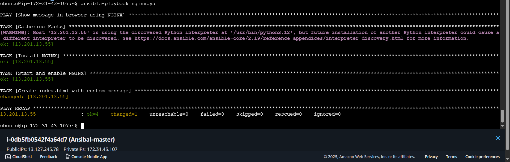

## launch two instances (ubuntu) 
## create ssh keypair
````
ssh-keygen
````

```bash
sudo cat .ssh/id_ed25519.pub
```
## worker node 
## copy public key And paste to worker node .ssh/authorized_keys file
## in worker node 
```bash
sudo nano .ssh/authorized_keys
```
## master 
**Install ansible on master node**
  

````
sudo apt-add-repository ppa:ansible/ansible
````
````
sudo apt update
````
````
sudo apt install ansible
````
````
ansible --version
````
### set up inventory file

````
sudo nano /etc/ansible/hosts
private-ip of worker nodes
````

### edit ansible.cfg

````
[defaults]
inventory = hosts
host_key_checking = False
````


### ping all nodes to test connection
````
ansible all -m ping
````

````
- hosts: all
  become: yes
  tasks:

    - name: update
      apt: update_cache=yes

    - name: Install Nginx
      apt: name=nginx state=latest

      notify:
        - restart nginx

  handlers:
    - name: restart nginx
      service: name=nginx state=reloaded
````
### run playbook
````
ansible-playbook nginx.yaml
````

````
---
- name: Show message in browser using NGINX
  hosts: all
  become: yes

  tasks:
    - name: Install NGINX
      apt:
        name: nginx
        state: present
      when: ansible_os_family == "Debian"

    - name: Start and enable NGINX
      service:
        name: nginx
        state: started
        enabled: yes

    - name: Create index.html with custom message
      copy:
        dest: /var/www/html/index.html
        content: |
          <html>
          <body>
          <h1>this is new update</h1>
          </body>
          </html>
````

